## Getting to the command line

_\`Almost every day I find myself working on the command line processing data, automating tasks that would otherwise take me many mundane hours to perform in a manual fashion. I hope, that through this course you'll also gain this enthusiasm and ability to work productively on the Unix command line.\`_

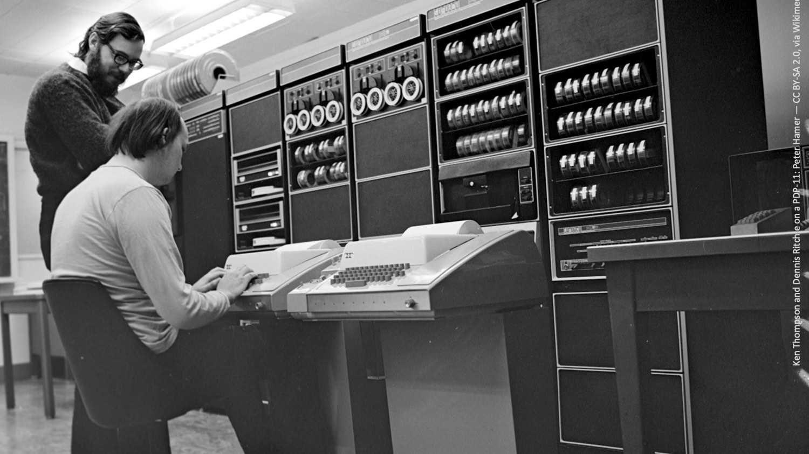

_\`Unix started its life in the early 1970s in the famous AT&T Bell Laboratories. This is the birthplace of many amazing inventions and discoveries including the transistor, radio astronomy, communication theory, and many others.\`_

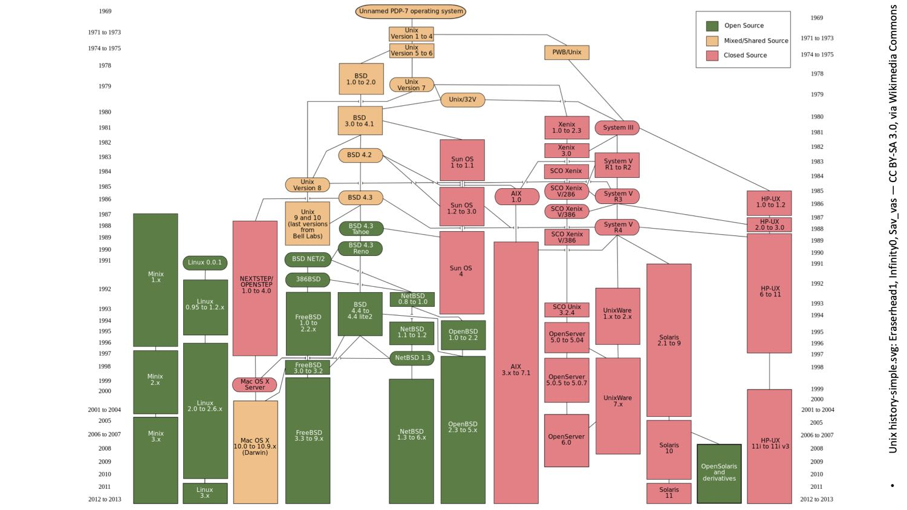

_\`It quickly spread to many universities and then companies. Nowadays Unix and systems closely following its ideas, such as Linux, run on billions of devices.
Quite possibly many devices in your home, such as your mobile phone, your TV or your broadband router might well be running on Unix.\`_

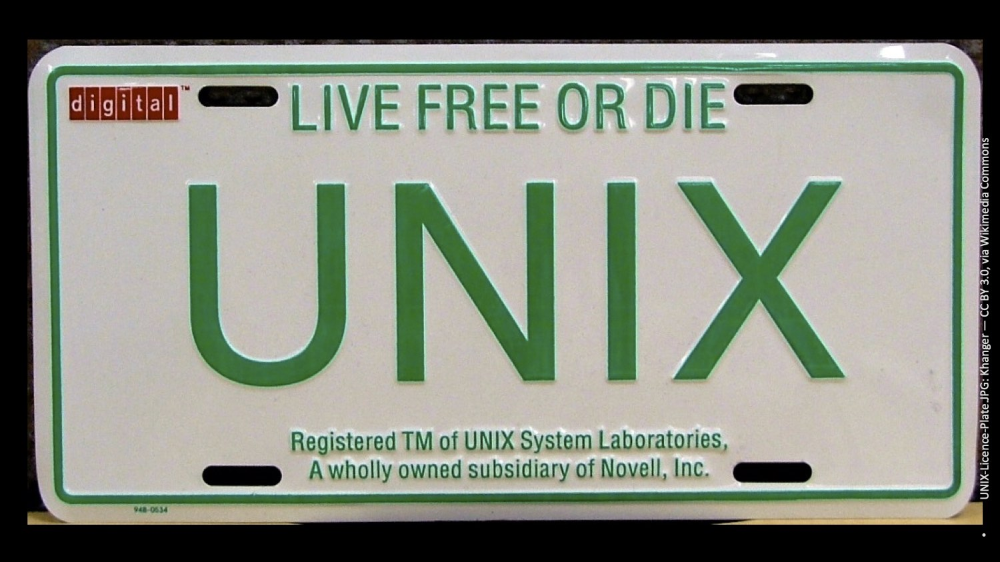

_\`Helped by its unusual simplicity, power and efficiency, Unix quickly acquired many devoted followers, both in universities, which use it extensively for research and teaching, and in the corporate world, initially as a must-have feature of most hardware vendors and nowadays as the default operating system used on the cloud.

_\`Many claim that you can fix anything with duct tape and lubricant: if it moves when it shouldn't then you tape it, if it doesn't move when it should you lubricate it. Similarly, on the Unix command line we can perform exceedingly well a large and diverse set of tasks spanning hot areas such as data engineering, software engineering, and production engineering. It's instructive to compare the versatility of the Unix command line, with that of tools featuring a graphical user interface, such as integrated development environments or spreadsheets. With graphical user interfaces, what they allow you to do is *all* you can do. Although you can easily perform some tasks, you can only perform the tasks that were envisaged by their designers. In contrast, on the Unix command line you can do almost everything, because you perform it by combining existing commands among thousands that are available.\`_

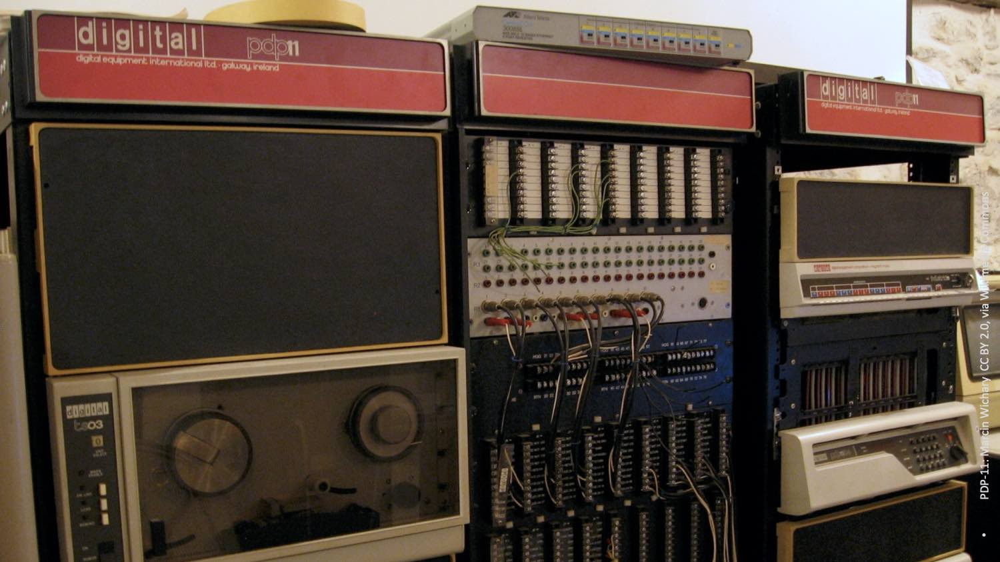

_\`The tools you use on the command line are also extremely fast and efficient. This stems partly from the fact that they were developed in the 1970s on a PDP-11 computer that had 64kB of RAM and ran at a clock speed of a few MHz. Consider how well they can perform today when they have GB of RAM available and run on clock speeds of GHz.\`_

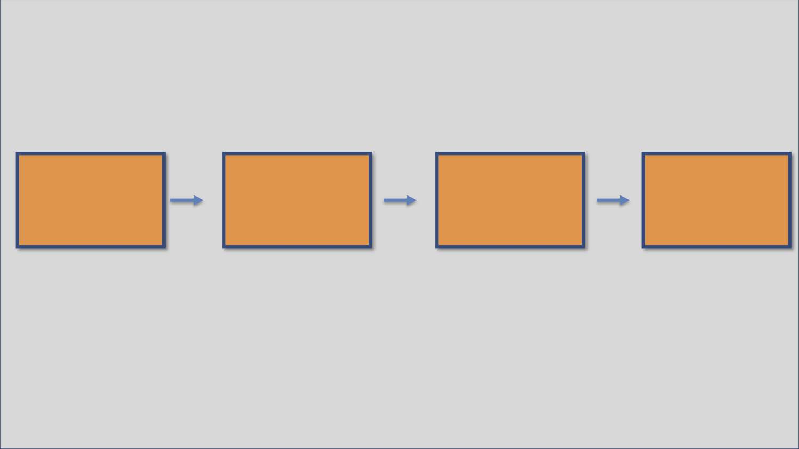

_\`Another reason for their excellent performance comes from the fact that they allow us to easily and naturally split our work on multiple independent processes, which can run in parallel on modern multi-core computers.\`_ 

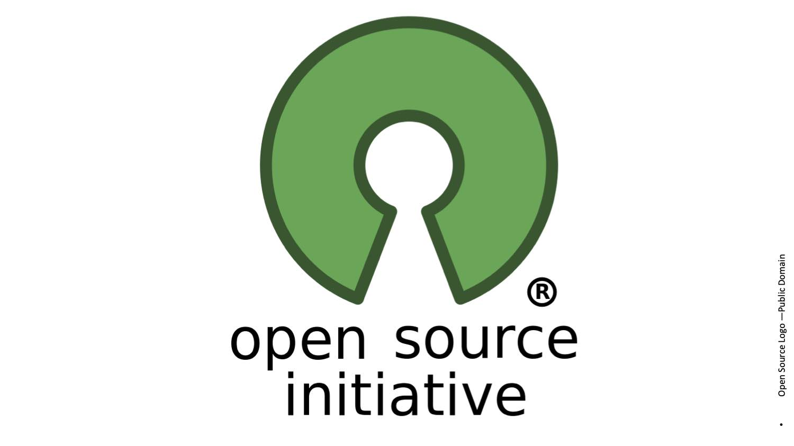

_\`Finally, another important advantage of Unix is that it's available as portable open source software, and therefore, we can find it on any imaginable platform.\`_

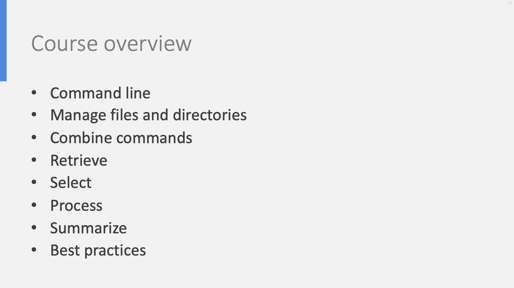

_\`Thus, you can find the commands we'll discuss here readily available on Linux, macOS and Windows. In this course we'll start with the basics:

- how we can get to the command line,
- how we can type-in and edit commands,
- how we can process files and directories,
- how we can combine them.\`_

_\`Then, we'll see a complete **cycle** that covers in a comprehensive fashion the processing of data on the Unix command line. This starts with **fetch**ing the data, continues with **select**ing the data we want to use, **process**ing them and finally **report**ing of the results of our processing. We'll end the course with common mistakes to avoid and best practices to follow.\`_

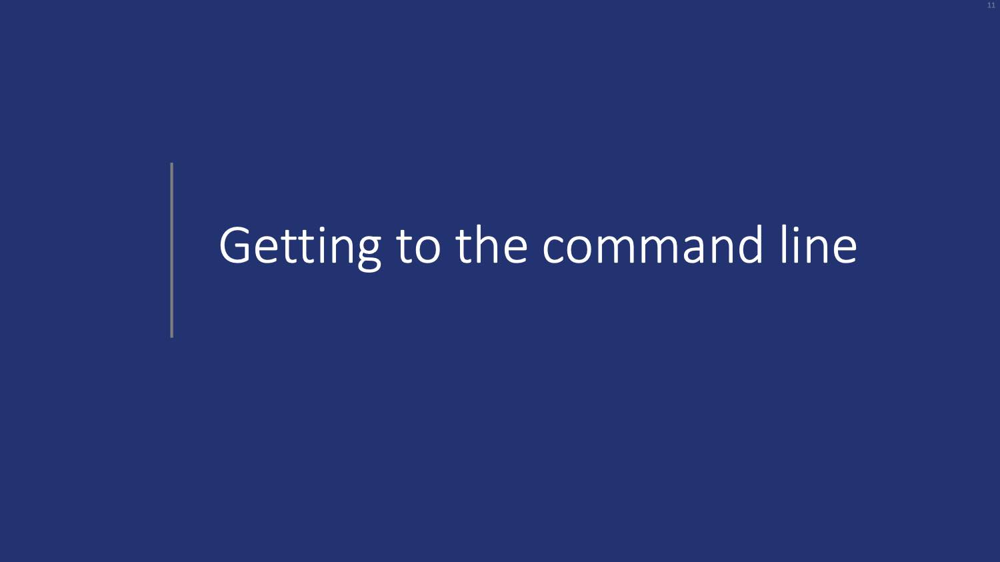

_\`Throughout this course it's important to follow what we'll be learning by actually running the examples, and experimenting with variations. For this reason it's important that you obtain a Unix command-line prompt. How you get to the Unix command line depends on the system you're using. We'll see some common examples, but you can use any method that suits you. \`_

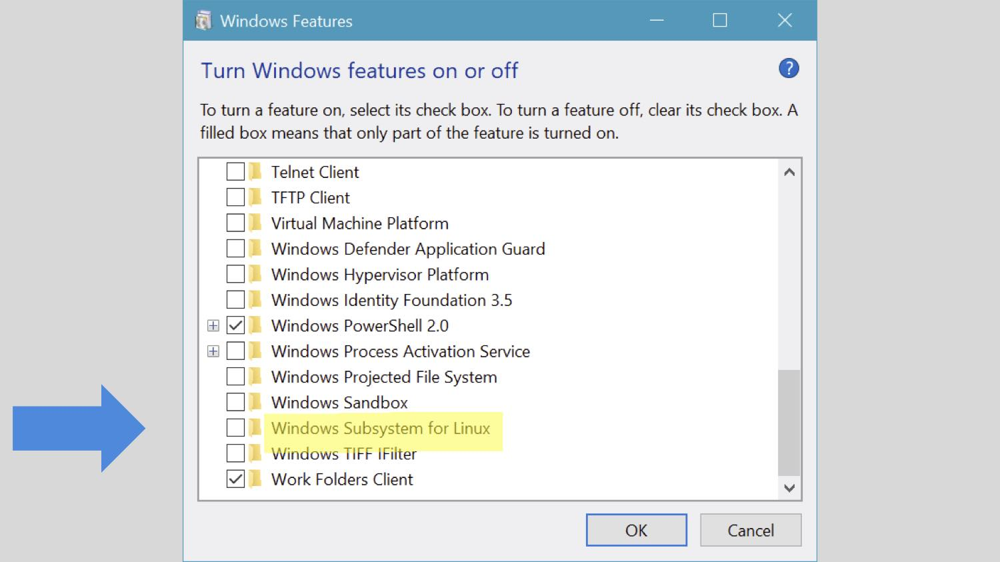

_\`Under Microsoft Windows you have two mainstream options. The first involves navigating to the Windows Features and settings, enabling the Windows Subsystem for Linux feature.\`_

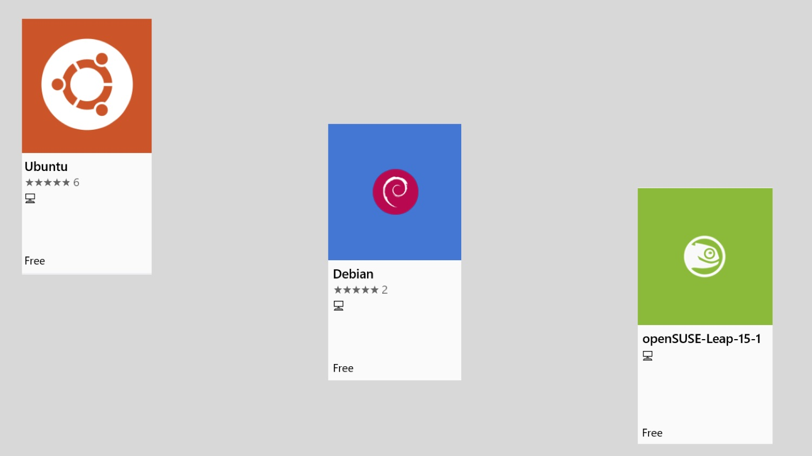

_\`Then you can open the Windows Store, and install a Linux distribution, such as Ubuntu, Debian or OpenSUSE. From that point onward you follow the steps associated with Linux. The main advantages for the Windows Subsystem for Linux path is its height performance and its very high compatibility with all Linux features.\`_

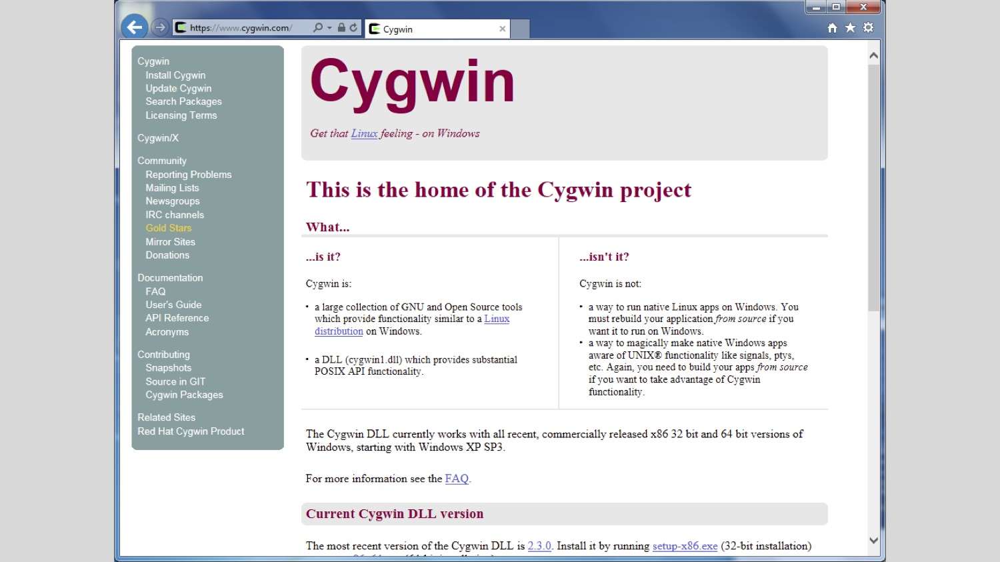

_\`The second option under Windows involves downloading and installing the Cygwin project and then running the Cygwin terminal from the Windows Start button. The main advantage of Cygwin is its tight integration with Windows programs; for example you can execute on the Cygwin Unix command line Windows command-line programs together with traditional Unix programs.\`_

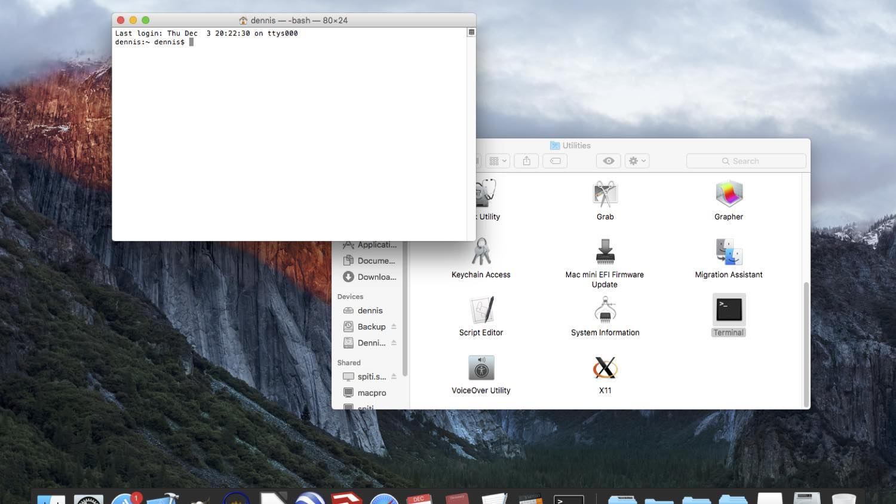

_\`If you're running macOS, you get to the command line simply by navigating to the Utilities folder of the finder commands and then launching the Terminal application.\`_

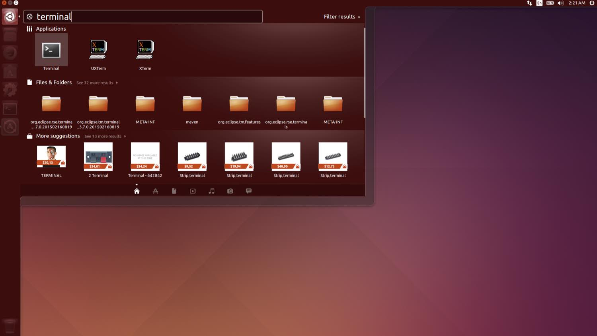

_\`Finally, under the Ubuntu GNU/Linux distribution, all you need to do is to press Control-Alt-T, or search and run the terminal application. This will get you a terminal window with the command line prompt. This concludes our foundations unit on getting to the command line. Stay with us for the rest of the course!\`_

## References

- [The Art of the Command Line](https://github.com/jlevy/the-art-of-command-line) (Pointer to web resource)
- [cat](https://pubs.opengroup.org/onlinepubs/9699919799/utilities/cat.html)(Unix command specification)
